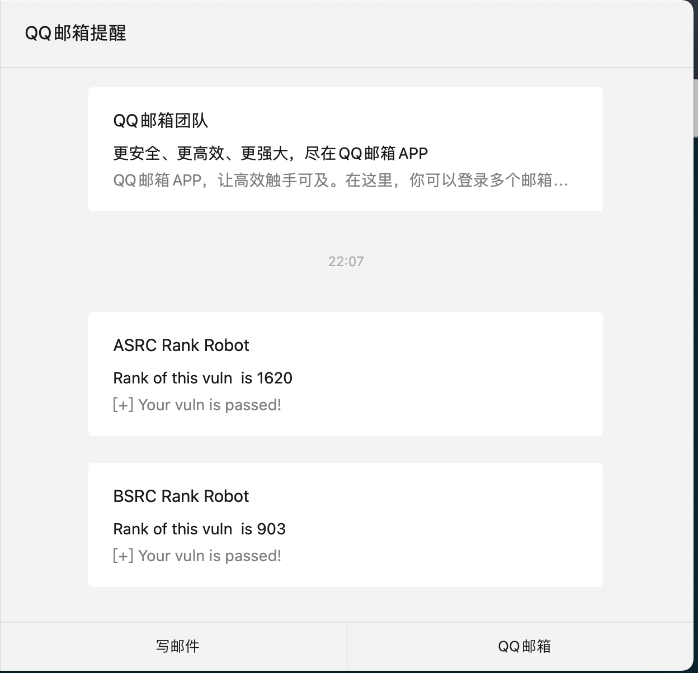

# rank_src
[](https://github.com/1in9e/icp-domains/tree/main/)

监控个人在SRC漏洞审核情况，并自动发邮件及时提醒

#### 目前已支持SRC
- ASRC: 阿里安全响应中心
- BSRC: 百度安全应急响应中心

## Usage

> 部署linux服务器，使用nohup后台运行即可实现漏洞审核通过提醒：

```
➜  ~ nohup python rank_src.py &
```


### Tips

 - 请求频率默认为5分钟一次，可修改：time.sleep(300)
 - 修改代码中SRC个人主页URL
 - 修改发件/收件Email
 - 修改初始积分/漏洞数量
 - 微信开启邮箱提醒

### Change Logs
- v0.2 2021.12.2 add bsrc; rank_asrc.py => rank_src.py
- v0.1 2019.2.14 create project: rank_asrc
